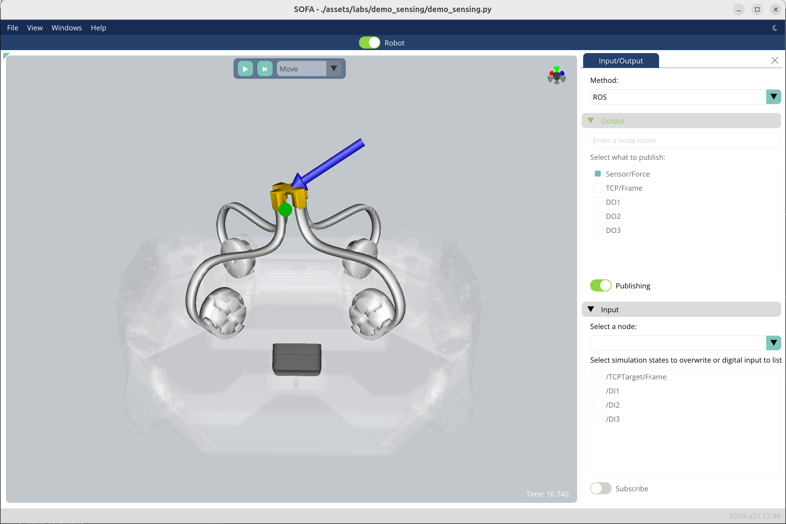

# Emio.demo_sensing

This is a demo for the [Emio robot](https://compliance-robotics.com/compliance-lab/), showcasing its sensing capabilities. The directory contains the necessary files to run the demo with the application [Emio Labs](https://mailchi.mp/compliance-robotics.com/download-emio-labs).

In this demo we fix the motor to a desired configuration. We chose a configuration that let us use Emio as a joystick. 
On the real device, we track the position of the effector using a marker and the depth camera.
The problem we want to solve is to retrieve the force applied by the user on the effector of Emio. To achieve this, we solve the inverse problem in simulation.  

We can then use Emio as a joystick and ROS2 to control a turtle in the [TurtleSim](https://docs.ros.org/en/jazzy/Tutorials/Beginner-CLI-Tools/Introducing-Turtlesim/Introducing-Turtlesim.html) simulation environment.

